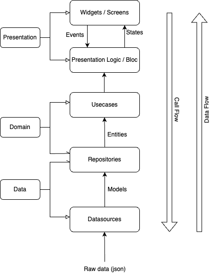

## Flutter Clean Architecture
A simple flutter app based on Reso Coder's tutorial but implemented using feature-driven architecture.

### What is used in this project?
- <b>Flutter bloc </b>
    To implement the BLoC (Business Logic Component) design pattern.
- <b>Freezed</b>
    Code generation for data classes
- <b>Get it</b>
    Service location used as dependency injection
- <b>Dartz</b>
    Functional Programming ` Either<Left,Right> `
- <b>Auto Route</b>
    Navigation package that uses code generation to simplify route setup
- <b>Dio</b>
    Http client for dart. Supports interceptors and global configurations
- <b>Shared Preferences</b>
    Persistent storage for simple data
- <b>Flutter and Dart</b>
    And obviously flutter and dart 😅
### Project Description

#### Data
The data layer is the outermost layer of the application and is responsible for communicating with the server-side or a local database and data management logic. It also contains repository implementations.

##### 1. Data Source

Describes the process of acquiring and updating the data.
Consist of remote and local Data Sources. Remote Data Source will perform HTTP requests on the API. At the same time, local Data sources will cache or persist data.
##### 2. Models

An entity will depend on the data acquired from the different data sources.
Serialization of JSON structure into Dart maps Entity objects to Models and vice-versa.
##### 3. Repository

The bridge between the Data layer and the Domain layer.
Actual implementations of the repositories in the Domain layer. Repositories are responsible for coordinating data from the different Data Sources.

#### Domain
The domain layer is responsible for all the business logic. It is written purely in Dart without flutter elements because the domain should only be concerned with the business logic of the application, not with the implementation details.

##### a. Use Cases

Describes the logic processing required for the application.
Communicates directly with the repositories.
##### b. Repositories

Abstract classes that define the expected functionality of outer layers.
##### c. Entities

Business objects of the application.
An entity will not depend on the data acquired from the server side.

#### Presentation
The presentation layer is the most framework-dependent layer. It is responsible for all the UI and handling the events in the UI. It does not contain any business logic.

##### a. Widget (Screens/Views)

Widgets notify the events and listen to the states emitted from the Bloc.
##### b. BloC

Receive the events from the views and interact with use cases accordingly.
Emit the state according to the data received from the use cases.
Bloc does not know about the view at all. It communicates in the form of states and events only.

### Run this project

##### Clone this repository
` git clone https://github.com/Uuttssaavv/flutter_clean_arch`

##### Go to the project directory
` cd flutter_clean_arch `

##### Get all the packages

`flutter pub get`

##### Run the build runner command 
` flutter pub run build_runner build  `

#### Run the integration tests
` flutter drive \                                                 
  --driver=test_driver/integration_test.dart \ --target=integration_test/app_test.dart  `

##### Run the project

` flutter run ` or simply press ` F5 key` if you are using VSCode

### About Me

Do visit my [portfolio site](https://utsavghimire.com.np) or connect with me on [linkedin](https://www.linkedin.com/in/utsav-ghimire-10352a18b/)